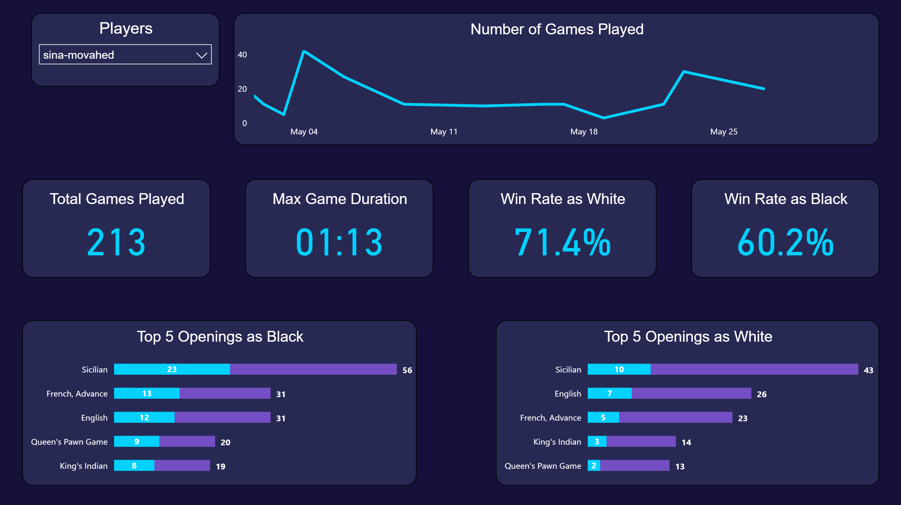

# Chess Data Pipeline: API to Power BI ♟️

This is a complete data engineering project that grabs games data from the **Chess.com API**, processes it in **Databricks**, and transforms it with **dbt** to make it ready for visualization in **Power BI**, with the main focus on **dbt**.

## How it Works

* **Get Data (Databricks):** A Python notebook hits the Chess.com API to get games from top players for a specific period.
* **Save Data (Delta Lake):** It saves the raw game data into a table called `dbt_demo.chess_games`.
* **Clean Data (dbt):** dbt picks up the raw data, extracts meaningful columns using Regex, and calculates game stats.
* **Enrich Data (dbt Seeds):** I upload a CSV file with opening names to translate codes like "B01" into "Scandinavian Defense".
* **Visualize Data:** I used Power BI and created a dashboard to show some important statistics of player

---

## The Pipeline Steps

### 1. Getting the Games (`Get-Load-Data.ipynb`)
I use a Databricks notebook to handle the API calls.
* **Find Players:** It grabs the current top 15 players from the Chess.com leaderboards.
* **Fetch Games:** It loops through these players and downloads their games for a specific month (e.g., 2025/05).

### 2. Extracting the Messy Stuff (`stage1_extracted_cols.sql`)
Chess games are stored in PGN strings (big blocks of text). To get data out of them, I used **Jinja Macros**.
* **The Macro:** I wrote a macro called `extract_pgn` that uses Regex to hunt for tags like `[StartTime "..."]` or `[ECO "..."]` inside the text.
* **Flattener:** This stage also pulls out simple things like the usernames for White and Black and the game result.

### 3. Cleaning & Logic (`stage2_filtered_mod_cols.sql`)
Now that the data is extracted, we need to fix the formats.
* **Game Duration:** I calculate the difference between the start and end times to see exactly how long the game lasted (formatted as `10m 05s`).
* **Standardizing Results:** The API gives complex results like "repetition" or "timevsinsufficient". I used a `CASE` statement to turn these into simple "Win", "Loss", or "Draw" labels.

### 4. Adding Opening Names (`stage3_add_eco.sql`)
* **The Problem:** The raw data only gives us "ECO codes" (like A00, B20), which are hard to read.
* **The Solution:** I used a **dbt Seed** file (`chess_openings_eco.csv`) that acts as a dictionary.
* **The Join:** In the final stage, I join the game data with this seed file. Now, instead of just "C00", the data says "French Defense".

---

## Tools I Used

* **Extraction:** Databricks (PySpark)
* **Transformation:** dbt (Data Build Tool) with Jinja & Regex
* **Source:** Chess.com Public API
* **Visualization:** Power BI

## Result

Here is the dashboard I created using Power BI. After choosing a player, you can see some statistics suchs as number of games played, win rate and top 5 openings as black and white.

